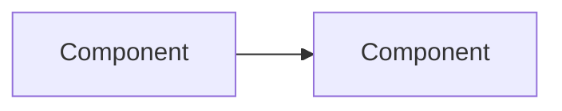

# {{TITLE}}

> [!info] Document context
> **Purpose:** [What this document covers and the decision or audience it serves.]  
> **Audience:** [Who should read this.]  
> **Status:** [Draft / For review / Final]
>
> Longform pages often extend frontmatter with `audience:`, `author:`, and multi-line `changes:` using YAML block scalar (`|`). These fields are outside the standard wiki schema but common for formal documents.

---

## 1. [Purpose]

[What this document covers, why it exists, and what it formalises.]

---

## 2. [Background]

[The situation or problem that makes this document necessary. Be concrete.]

---

## 3. [Architecture / Design / Approach]

[Main content. Use numbered subsections for navigability; Mermaid diagrams for systems, flows, and relationships; tables for structured comparisons; code fences for syntax, queries, or formulas.]

### 3.1 [Subsection]

---

## 4. [Details]

---

## 5. Open Questions

> [!question] Decisions pending
> Number open questions for easy reference in discussion.

**Q1.** [Question] - Recommendation: [stance if any]

---

## Appendix A: [Title]

[Supporting material, worked examples, or reference tables.]

---

## References

| Title | Author | Date | Link |
|---|---|---|---|
